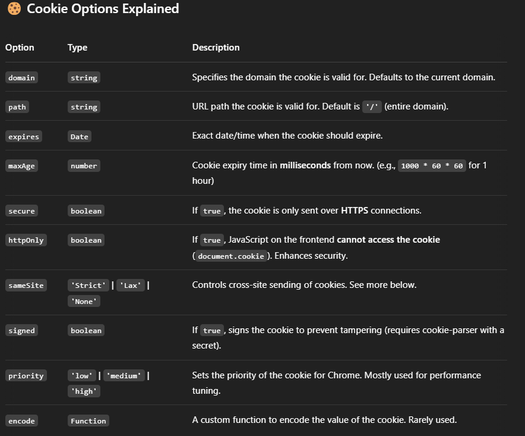
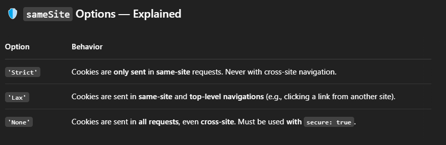

# Cookies options




`domain:` Specifies which domain(s) the cookie is valid for. Example: .example.com means all subdomains. For local dev, omit or use your IP (e.g., 192.168.1.5). Avoid .localhost, it can cause issues.

</br>

`path:` Limits the cookie to a specific URL path. Default is '/', meaning it's sent to all routes. No difference between HTTP and HTTPS. Useful for segmenting cookies per route.

</br>

`sameSite:` Controls whether the cookie is sent with cross-origin requests. Values: 'Strict', 'Lax', 'None'. If using 'None', you must use secure: true (i.e., HTTPS), or the cookie will be rejected by browsers.

</br>

`signed:` Signs the cookie using a secret (requires cookie-parser). Prevents tampering. Works for both HTTP and HTTPS. Doesn't encrypt the value, just adds a h
</br>

`priority:` Tells the browser how important the cookie is ('low', 'medium', 'high'). Used for performance tuning (rarely needed). Mostly relevant in Chrome. Works on both HTTP and HTTPS.

</br>

`encode:` Custom function to encode the cookie’s value. Use if you need non-standard encoding. Rarely needed. Works the same in HTTP and HTTPS.

</br>

# Enable HTTP

### commands

`mkcert -install` install mkcert \
`mkcert localhost` generate certificate contains -->

- localhost.pem (certificate)
- localhost-key.pem (private key)

put certificates in `/cert` folder

### use certificate

1. vite

`vite.config.js:`

```
import { defineConfig } from 'vite';
import fs from 'fs';
import react from '@vitejs/plugin-react'; // if you're using React

export default defineConfig({
  plugins: [react()],
  server: {
    https: {
      key: fs.readFileSync('./cert/localhost-key.pem'),
      cert: fs.readFileSync('./cert/localhost.pem'),
    },
    port: 5173,
    host: 'localhost'
  }
});

```

`Access https://localhost:5173`

2. Express

```
const express = require("express");
const https = require("https");
const fs = require("fs");
const path = require("path");

const app = express();

// Middleware / routes here
app.get("/", (req, res) => {
  res.send("Hello from HTTPS Express!");
});

// Read SSL certs
const sslOptions = {
  key: fs.readFileSync(path.join(__dirname, "cert", "localhost-key.pem")),
  cert: fs.readFileSync(path.join(__dirname, "cert", "localhost.pem")),
};

// HTTPS server for production
https.createServer(sslOptions, app).listen(3001, () => {
  console.log("🚀 HTTPS server running at https://localhost:3001");
});

// HTTP server for local use
http.createServer(app).listen(3000, () => {
  console.log("🔓 HTTP server at http://localhost:3000");
});

```

Access Express app

- `HTTP: http://localhost:3000`

- `HTTPS: https://localhost:3001`
